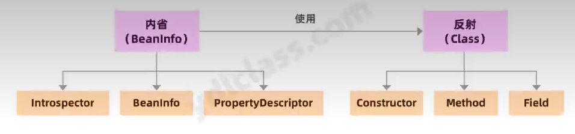

# Spring

## 第一章


```java
import org.example.entity.MyConfiguration;
import org.junit.Test;
import org.slf4j.Logger;
import org.slf4j.LoggerFactory;
import org.springframework.beans.factory.support.BeanDefinitionRegistry;
import org.springframework.beans.factory.support.SimpleBeanDefinitionRegistry;
import org.springframework.beans.factory.xml.XmlBeanDefinitionReader;
import org.springframework.context.annotation.AnnotatedBeanDefinitionReader;
import org.springframework.context.annotation.ClassPathBeanDefinitionScanner;

import java.util.Arrays;

public class BeanDefinitionTest {
    Logger logger = LoggerFactory.getLogger(BeanDefinitionTest.class);
    @Test
    public void testRegistryByXml(){
        BeanDefinitionRegistry registry = new SimpleBeanDefinitionRegistry();
        XmlBeanDefinitionReader xmlReader = new XmlBeanDefinitionReader(registry);
        xmlReader.loadBeanDefinitions("classpath:bean.xml");
        logger.info("Dog -> {}",registry.getBeanDefinition("dog").getBeanClassName());

    }
    @Test
    public void testRegistryByAnnotation(){
        BeanDefinitionRegistry registry = new SimpleBeanDefinitionRegistry();
        AnnotatedBeanDefinitionReader annoReader = new AnnotatedBeanDefinitionReader(registry);
        //需要ConfigurationClassBeanDefinitionReader读取配置类，单这个类不让我们使用
        annoReader.register(MyConfiguration.class);
        logger.info(Arrays.toString(registry.getBeanDefinitionNames()));
    }
    @Test
    public void testRegistryByAnnotation2(){
        BeanDefinitionRegistry registry = new SimpleBeanDefinitionRegistry();
        ClassPathBeanDefinitionScanner scanner = new ClassPathBeanDefinitionScanner(registry);
        scanner.scan("org.example");
        logger.info(Arrays.toString(registry.getBeanDefinitionNames()));
    }
}
```


```java
@Test
    public void testRegistryByAnnotation2(){
        BeanDefinitionRegistry registry = new SimpleBeanDefinitionRegistry();
        ClassPathBeanDefinitionScanner scanner = new ClassPathBeanDefinitionScanner(registry);
        scanner.scan("org.example");
        logger.info(Arrays.toString(registry.getBeanDefinitionNames()));
    }
```


```java
public int scan(String... basePackages) {
        int beanCountAtScanStart = this.registry.getBeanDefinitionCount();
        this.doScan(basePackages);
        if (this.includeAnnotationConfig) {
            AnnotationConfigUtils.registerAnnotationConfigProcessors(this.registry);
        }

        return this.registry.getBeanDefinitionCount() - beanCountAtScanStart;
    }
```


```java
 protected Set<BeanDefinitionHolder> doScan(String... basePackages) {
        Assert.notEmpty(basePackages, "At least one base package must be specified");
        Set<BeanDefinitionHolder> beanDefinitions = new LinkedHashSet();
        String[] var3 = basePackages;
        int var4 = basePackages.length;

        for(int var5 = 0; var5 < var4; ++var5) {
            String basePackage = var3[var5];
            Set<BeanDefinition> candidates = this.findCandidateComponents(basePackage);
            Iterator var8 = candidates.iterator();

            while(var8.hasNext()) {
                BeanDefinition candidate = (BeanDefinition)var8.next();
                //如果存在，则解析scope注解，为候选bean设置代理的方式ScopedProxyMode，XML属性也能配置，scope-resolver，scope-proxy，可以指定代理方式jdk或者cglib
                ScopeMetadata scopeMetadata = this.scopeMetadataResolver.resolveScopeMetadata(candidate);
                candidate.setScope(scopeMetadata.getScopeName());
                //首先从注解中获取bean的名字，如果没有使用beanName生成器beanNameGenerator来生成beanName，在注解中的bean的默认名称和xml是不一致的，注解中如果没有指定名字本质是通过ClassUtil的getShortName方法获取的
                String beanName = this.beanNameGenerator.generateBeanName(candidate, this.registry);
                if (candidate instanceof AbstractBeanDefinition) {
                    this.postProcessBeanDefinition((AbstractBeanDefinition)candidate, beanName);
                }

                if (candidate instanceof AnnotatedBeanDefinition) {
                    AnnotationConfigUtils.processCommonDefinitionAnnotations((AnnotatedBeanDefinition)candidate);
                }

                if (this.checkCandidate(beanName, candidate)) {
                    BeanDefinitionHolder definitionHolder = new BeanDefinitionHolder(candidate, beanName);
                    definitionHolder = AnnotationConfigUtils.applyScopedProxyMode(scopeMetadata, definitionHolder, this.registry);
                    beanDefinitions.add(definitionHolder);
                    this.registerBeanDefinition(definitionHolder, this.registry);
                }
            }
        }

        return beanDefinitions;
    }
```

```java
public Set<BeanDefinition> findCandidateComponents(String basePackage) {
        return this.componentsIndex != null && this.indexSupportsIncludeFilters() ? this.addCandidateComponentsFromIndex(this.componentsIndex, basePackage) : this.scanCandidateComponents(basePackage);
    }
```

扫包

```java
private Set<BeanDefinition> scanCandidateComponents(String basePackage) {
    Set<BeanDefinition> candidates = new LinkedHashSet();

    try {
        //classpath*会扫描jar包下的内容
        //org.example -> classpath*:org/example/**/*.class
        String packageSearchPath = "classpath*:" + this.resolveBasePackage(basePackage) + '/' + this.resourcePattern;
        Resource[] resources = this.getResourcePatternResolver().getResources(packageSearchPath);
        boolean traceEnabled = this.logger.isTraceEnabled();
        boolean debugEnabled = this.logger.isDebugEnabled();
        Resource[] var7 = resources;
        int var8 = resources.length;

        for(int var9 = 0; var9 < var8; ++var9) {
            Resource resource = var7[var9];
            if (traceEnabled) {
                this.logger.trace("Scanning " + resource);
            }

            if (resource.isReadable()) {
                try {
                    //getMetadataReade方法会生成一个元数据读取器
                    MetadataReader metadataReader = this.getMetadataReaderFactory().getMetadataReader(resource);
                    //检查读取到的类是否可以作为候选组件x，是否符合Typefilter类型过滤器要求
                    //使用IncludeFilter，就是目标类上没有@Component注解，它也会被扫描成为一个Bean
                    //使用ExcludeFilter，就是目标类上有@Component注解，它也会不会被扫描成为一个Bean
                    if (this.isCandidateComponent(metadataReader)) {
                        //构建一个ScannedGenericBeanDefinition
                        ScannedGenericBeanDefinition sbd = new ScannedGenericBeanDefinition(metadataReader);
                        sbd.setResource(resource);
                        sbd.setSource(resource);
                        if (this.isCandidateComponent((AnnotatedBeanDefinition)sbd)) {
                            if (debugEnabled) {
                                this.logger.debug("Identified candidate component class: " + resource);
                            }

                            candidates.add(sbd);
                        } else if (debugEnabled) {
                            this.logger.debug("Ignored because not a concrete top-level class: " + resource);
                        }
                    } else if (traceEnabled) {
                        this.logger.trace("Ignored because not matching any filter: " + resource);
                    }
                } catch (Throwable var13) {
                    throw new BeanDefinitionStoreException("Failed to read candidate component class: " + resource, var13);
                }
            } else if (traceEnabled) {
                this.logger.trace("Ignored because not readable: " + resource);
            }
        }
//全部返回
        return candidates;
    } catch (IOException var14) {
        throw new BeanDefinitionStoreException("I/O failure during classpath scanning", var14);
    }
}
```

## 第二章




内省api的一般的做法是通过类Introspector的getBeanInfo信息，然后通过BeanInfo来获取某个对象的BeanInfo信息，然后通过BeanInfo来获取属性的描述符PropertyDescriptor，通过这个属性描述器可以获取某个属性对应的取值/赋制方法，然后我们可通过反射来调用这些方法

```java
@Test
    public void testIntrospect() throws IntrospectionException {
        BeanInfo beanInfo = Introspector.getBeanInfo(Boss.class, Object.class);
        PropertyDescriptor[] propertyDescriptors = beanInfo.getPropertyDescriptors();
        for (PropertyDescriptor propertyDescriptor : propertyDescriptors) {
            logger.info("{}",propertyDescriptor.getPropertyType());
            logger.info("{}",propertyDescriptor.getReadMethod());
            logger.info("{}",propertyDescriptor.getWriteMethod());
        }
    }
```


```java
 @Test
    public void testIntrospect2() throws IntrospectionException, InvocationTargetException, IllegalAccessException {
        Boss boss = new Boss();
        PropertyDescriptor pd = new PropertyDescriptor("age", Boss.class);
        Method method = pd.getWriteMethod();
        method.invoke(boss,24);
        method = pd.getReadMethod();
        System.out.println(method.invoke(boss,null));
    }
```

引入

```xml
<dependency>
            <groupId>commons-beanutils</groupId>
            <artifactId>commons-beanutils</artifactId>
            <version>1.9.4</version>
</dependency>
```

```java
@Test
    public void testBeanUtils() throws Exception{
        Boss boss = new Boss();
        BeanUtils.setProperty(boss,"name","zhangsan");
        BeanUtils.setProperty(boss,"age","23");
        logger.info("boss ->",boss);
    }
```

Spring给我们提供了强大的反射工具BeanWrapper

BeanDefinition通过扫包获取的元数据


```xml
PropertyAccessException 1:
org.springframework.beans.ConversionNotSupportedException: Failed to convert property value of type 'org.springframework.beans.factory.config.TypedStringValue' to required type 'java.lang.String' for property 'color'; nested exception is java.lang.IllegalStateException: Cannot convert value of type 'org.springframework.beans.factory.config.TypedStringValue' to required type 'java.lang.String' for property 'color': no matching editors or conversion strategy found
```


ResolvableType可以封装Java类型，提供对超类类型，接口和泛型参数的访问，以及最终解析为类的能力，这是非常常见的一个类，它能极其方便的简化对反射api的调用，该类在spring中的使用率非常高。

```java
private Map<String,Integer> map = new HashMap<>(8);

    @Test
    public void testBatchCreate() throws Exception{
        ResolvableType type = ResolvableType.forField(getClass().getDeclaredField("map"));
        logger.info("{}",type.getType());
        logger.info("{}",type.asMap());
        logger.info("{}",type.getGeneric(0));
        logger.info("{}",type.getGeneric(1));

    }
```


```java
package org.example.tool;

import org.springframework.beans.factory.config.TypedStringValue;
import org.springframework.core.convert.TypeDescriptor;
import org.springframework.core.convert.converter.GenericConverter;

import java.util.Collections;
import java.util.Set;

public class TypeStringValueToIntegerConvert implements GenericConverter {
    @Override
    public Set<ConvertiblePair> getConvertibleTypes() {
        return Collections.singleton(new GenericConverter.ConvertiblePair(TypedStringValue.class, Integer.class));
    }

    @Override
    public Object convert(Object source, TypeDescriptor sourceType, TypeDescriptor targetType) {
        TypedStringValue typedStringValue = (TypedStringValue) source;
        return Integer.valueOf(typedStringValue.getValue());
    }
}
```

```java
@Test
    public void testBatchCreate() throws Exception{
        BeanDefinitionRegistry registry = new SimpleBeanDefinitionRegistry();
        XmlBeanDefinitionReader xmlReader = new XmlBeanDefinitionReader(registry);
        xmlReader.loadBeanDefinitions("classpath:bean.xml");

        String[] definitionNames = registry.getBeanDefinitionNames();
        for (String definitionName : definitionNames) {
            BeanDefinition beanDefinition = registry.getBeanDefinition(definitionName);
            String beanClassName = beanDefinition.getBeanClassName();
            Class<?> aClass = Class.forName(beanClassName);
            //使用BeanWrapper包裹实例，使其更方便使用反射方法
            BeanWrapper beanWrapper = new BeanWrapperImpl(aClass);
            //需要自定义转化服务
            DefaultConversionService service = new DefaultConversionService();
            service.addConverter(new TypeStringValueToIntegerConvert());
            beanWrapper.setConversionService(service);
            beanWrapper.setPropertyValues(beanDefinition.getPropertyValues());
            Object bean = beanWrapper.getWrappedInstance();
            System.out.println(bean);
        }

    }
```

Converters


```java
private static class ConvertersForPair {
    private final LinkedList<GenericConverter> converters;

    private ConvertersForPair() {
        this.converters = new LinkedList();
    }

    public void add(GenericConverter converter) {
        this.converters.addFirst(converter);
    }

    @Nullable
    public GenericConverter getConverter(TypeDescriptor sourceType, TypeDescriptor targetType) {
        Iterator var3 = this.converters.iterator();

        GenericConverter converter;
        do {
            if (!var3.hasNext()) {
                return null;
            }

            converter = (GenericConverter)var3.next();
        } while(converter instanceof ConditionalGenericConverter && !((ConditionalGenericConverter)converter).matches(sourceType, targetType));

        return converter;
    }

    public String toString() {
        return StringUtils.collectionToCommaDelimitedString(this.converters);
    }
}
```


------

学习资源取自：

https://www.bilibili.com/video/BV1zd4y1L7YD?p=3&spm_id_from=pageDriver&vd_source=ba478964f41c9df0a7b32fc78b3d7c3c


